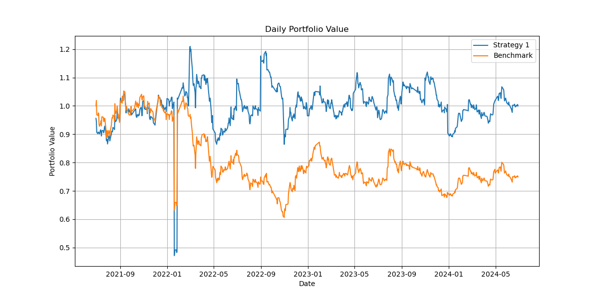

# Stock_Investment
对中信证券(600030)、招商银行(600036)两只股票使用 **投资策略** 和 **基准策略** 计算在投资期内每日投资组合的价值

# 要求
假设投资于以下两只股票：中信证券、招商银行。投资从2021年6月30日开始（以当日收盘价进入），到2024 年6月28日结束（以当日收盘价结束）。初始总资金为1 单位货币。不考虑交易成本。

**投资策略1：** 在建仓日（2021 年 6月 30日）和所有双月（2、4、6、8、10、 12月）的最后一个交易日调整仓位。每个调仓日基于过去 6个月（t-5 月~t 月）的日度简单收益率，分别计算两者的波动率（以标准差度量），并计算两者收益率的相关系数，然后计算最小方差组合的权重（要求权重非负），以该权重占比调整每只股票的持仓。

**基准策略2：** 在建仓日以各股票的市值占比建仓，不调仓，买入并持有。

# 任务
```
1、使用投资策略1，用文字和数学公式详细描述计算权重、以及计算投资组合每日价值的算法步骤，可以使用文字、流程图或伪代码等形式。
2、下载数据、调整格式、并保存为csv文件。
3、编写Python代码，计算投资策略1 每个调仓日的权重，结果保存为csv文件。
4、编写 Python 代码实现投资策略，计算投资策略 1 和基准策略 2 在投资期内每日投资组合的价值，并将投资组合每日价值的结果保存为 csv文件。
5、绘制任务3、4的结果，保存为图片。
```


### 计算权重步骤

1. **数据准备**：
   - 获取两只股票从2021年6月30日至2024年6月28日的每日收盘价数据。
   - 计算从2021年6月30日开始，每个双月（2、4、6、8、10、12月）的最后一个交易日的日期列表。

2. **收益率和波动率计算**：
   - 对于每个调仓日，计算过去6个月（t-5月~t月）的日度简单收益率：

     $$
     R_{i,t} = \frac{P_{i,t} - P_{i,t-1}}{P_{i,t-1}}
     $$
   
     $$
     其中，R_{i,t}是股票是股票 i 在第 t 天的收益率，  P_{i,t}  是股票  i  在第  t  天的收盘价。
     $$
   
3. **波动率和相关系数计算**：
   
   - 计算每只股票在过去6个月内的日度收益率标准差（波动率）：

     
$$
     sigma_i = \sqrt{\frac{1}{n-1} \sum_{t=1}^{n} (R_{i,t} - \bar{R_i})^2}
$$

$$
     其中，  bar{R_i}  是股票  i  的平均日收益率。
$$
     
     
     
   - 计算两只股票收益率的相关系数：

$$
     \rho_{12} = \frac{\sum_{t=1}^{n} (R_{1,t} - \bar{R_1})(R_{2,t} - \bar{R_2})}{\sqrt{\sum_{t=1}^{n} (R_{1,t} - \bar{R_1})^2 \sum_{t=1}^{n} (R_{2,t} - \bar{R_2})^2}} 
$$
   
4. **最小方差组合权重计算**：
   - $$
     设  w_1  和  w_2  分别为两只股票的权重，满足  w_1 + w_2 = 1  且  w_1, w_2 \geq 0 。
     $$
   
   - 使用如下公式计算最小方差组合权重：

$$
     w_1 = \frac{\sigma_2^2 - \rho_{12} \sigma_1 \sigma_2}{\sigma_1^2 + \sigma_2^2 - 2 \rho_{12} \sigma_1 \sigma_2}
$$
  
$$   
     w_2 = 1 - w_1
$$

### 计算投资组合每日价值的算法步骤

1. **初始资金分配**：
   - 在2021年6月30日按市值占比建仓，计算每只股票的初始持仓数量：

$$
     \text{持仓数量} = \frac{\text{初始资金} \times \text{权重}}{\text{建仓日收盘价}}
$$

2. **投资组合每日价值计算**：
   - 在每个交易日，计算投资组合的总价值：

$$
     \text{组合价值}_t = \sum_{i=1}^{2} (\text{持仓数量}_i \times P_{i,t})
$$
   
   - 在每个调仓日，根据新的权重调整持仓数量：

$$
     \text{新持仓数量}_i = \frac{\text{组合价值}_{\text{调仓日}} \times \text{新权重}_i}{P_{i,\text{调仓日}}} 
$$

### 结果
基准1和基准2每日价值对比

